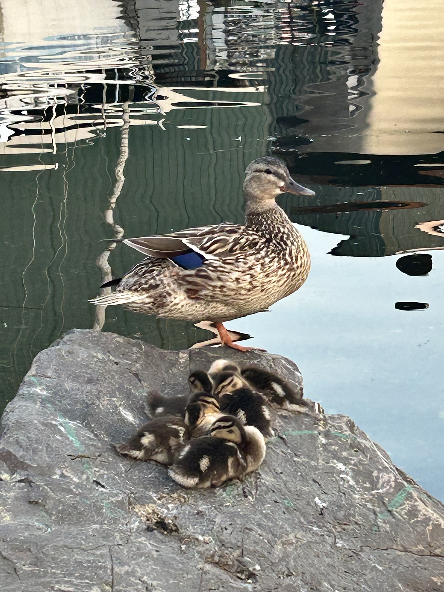

My wife and I moved to Seattle two years ago, mostly for shits and giggles. More honestly, we had soured on Austin, Texas. Lexi and I were not fans of the implacable heat, or the worsening ice storms, which twice cut our power for days (the grid is [still](https://removepaywalls.com/https://www.forbes.com/sites/edhirs/2025/05/11/texas-is-failing-to-fix-the-grid-again/) not fixed). But more than anything, we resented how the city and the state worship at the altar of the freeway.[^1] To get anywhere, to do anything, meant at least 15 minutes braving ever-widening lanes, high-speed exits, and some of the [worst drivers](https://www.texasmonthly.com/news-politics/texas-drivers-bad/) in the country. A crash even totaled Lexi's car, and because the other driver was underinsured, Lexi received no compensation for months. Needless to say, when the opportunity to leave Austin arose, we took it. Nursing meant Lexi could work almost anywhere, and I had secured a year-long fellowship to write my dissertation. Why not try a new city?

[^1]: just one more lane bro. i promise bro just one more lane and it'll fix everything bro. bro. just one more lane. please just one more. one more lane and we can fix this whole problem bro. bro cmon just give me one more lane i promise bro. bro bro please i just need one more lane

How did we settle on Seattle? This is where the "shits and giggles" come into play. The only connection we had to the city was one of Lexi's uncles, who worked there as a travel nurse. So, we decided to pay him a visit, feel out some of Seattle's neighborhoods, and search for an apartment. He showed us Phinney Ridge, and we sauntered around Green Lake, the water placid after the morning drizzle had tapered off. The natural beauty of the area made it easy for Lexi and me to picture ourselves here. And after a few underwhelming apartment tours, we found an agreeable spot in Ballard — home to the inimitable, short-spined raccoon ["Jimothy."](https://www.nytimes.com/2026/07/21/style/jimothy-raccoon-seattle-videos.html) The neighborhood had plentiful parks, robust public transportation, and — most importantly for us — walkable streets.

{fig-align="center" width="800"}

The other night, on our post-dinner walk, Lexi described Seattle, and Ballard in particular, as a "pedestrian-forward city." In two words (three, if you're pedantic), that about sums up why we have loved living here so much. We can travel on foot almost anywhere — to the grocery store, the pharmacy, the (weekly) farmers market, the beach, the gym — you name it. Not having to get in the car every time I need to do some task is nothing short of a boon for my mental health. What's more, Ballard boasts the ["Little Free Bakery,"](https://www.instagram.com/littlefreebakeryballard/) which hands out free baked goods every week; community events galore whose posters crowd most telephone poles; countless little libraries (including a Blockbuster-themed one); and homes that range from subtly precious to unabashedly goofy. Our rambles through these streets — some sequence of left and right turns along the grid — always reveal something new. Last week, it was two young crow parents feeding a fledgling on the power lines before launching into a flying lesson. The week before that, a neighborly black cat on a side quest for some pets from unsuspecting strangers. Last night, a duck family perched on a boulder, the young ones cuddling for warmth (see below).[^2]

[^2]: Not far from here, there is a dock with an abandoned ship, torn apart and covered in graffiti. Its name, ICGV *Albert*, is barely visible. After some digging, I stumbled upon a [photo](https://en.wikipedia.org/wiki/Cod_Wars#/media/File:CoventryAlbertWestfj.jpg) of the ship on Wikipedia. This derelict vessel once rode the high seas during the Cod Wars! These "wars" were a series of skirmishes between Iceland and the United Kingdom over fishing rights in the North Atlantic from 1958 to 1976.\
    \

{fig-align="center" width="600"}

Parks are the constant of our strolls. There are six within a one-mile radius of our apartment. In fact, Seattle's park system [ranks 8th](https://www.tpl.org/city/seattle-washington) among those of the 100 most populous U.S. cities (Austin ranks 47th), with 99% (!) of residents living within a 10-minute walk of a park. No statistic has ever matched my experience of a city so closely. The *crème de la crème*, however, is the Carl S. English Jr. Botanical Garden, which connects to the Ballard Locks and its fish ladder. The garden is a floral refuge for both humans *and* dogs, home to more than 500 plant species, each adorned with a taxonomic name card for the neophytes. The garden's trees open onto the water, where at sunset the stillness of the lock is broken only by a leaping minnow. Across the bridge is the fish ladder, where an underwater window lets us observe salmon on an upstream journey. From June through September, sockeye, chinook, and coho salmon (in that order!) return to the appropriately named Salmon Bay to spawn. On the way home, we sometimes treat ourselves to a cup of clam chowder from the [Lockspot Café](https://www.thelockspot.com/), a cozy, unpretentious diner that also sells a mean key lime pie.

Seattle has taught Lexi and me much about ourselves — specifically, what we want and need from a home, a neighborhood, a city. It took only two years for the mixed-use streets, the parks, and the community events to make this place feel like home. Maybe someday we'll return; maybe we won't. Either way, we know now what to look for. At the end of next week we leave for Columbia, South Carolina, where I'm starting a new job. Though those streets will be unfamiliar, we'll carry the Pacific Northwest with us, mostly in our walking shoes.
