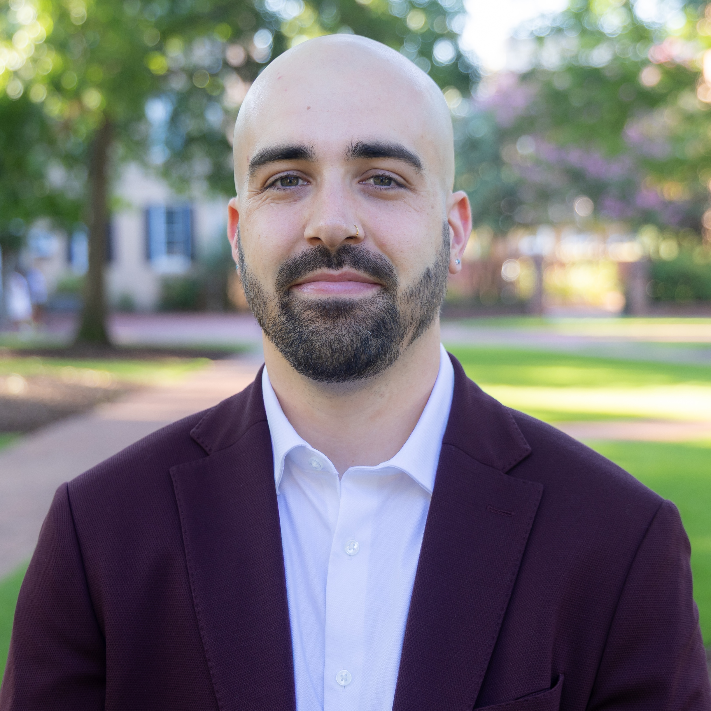

:::: {.va-trestles}

```{=html}
<div class="va-trestles-left">
  <div class="va-portrait">
    
  </div>
  <div class="va-namecard">
    <div class="name">Matt Martin</div>
    <div class="va-appointment">
      <div class="role">Postdoctoral Researcher</div>
      <div class="org">Comparative Constitutions Project</div>
    </div>
  </div>
</div>
```

::: {.va-bio}
My name is Matt Martin (he/him), and I am an incoming Assistant Professor of Political Science at the [University of South Carolina](https://sc.edu/study/colleges_schools/artsandsciences/political_science/index.php). I am also Associate Director of the [Comparative Constitutions Project](https://comparativeconstitutionsproject.org/). I received my PhD in Government from the University of Texas at Austin, specializing in public law and comparative politics.

My research examines constitution-making processes, focusing on mechanisms of public consultation. My dissertation analyzes how and why constitutional drafters engage public consultation—and what they do with the input they receive—through comparative case studies of Chile and Cuba. I combine large-N analyses and natural language processing with elite interviews and qualitative case research.

My work has appeared in *[Social Science Computer Review](https://doi.org/10.1177/08944393261443513)*, *[Comparative Politics](https://doi.org/10.5129/001041526X17731675177333)*, *[Polity](https://www.journals.uchicago.edu/doi/10.1086/739835)*, *[Política](https://revistapolitica.uchile.cl/index.php/RP/article/view/81160)*, the *[Journal of Law and Courts](https://www.cambridge.org/core/journals/journal-of-law-and-courts/article/elite-fractures-public-capture-the-strategic-use-of-public-consultation-in-global-constitutionmaking/A6BBCC7D2A7B5744D7766ABB4293595D)*, and *[PLOS ONE](https://journals.plos.org/plosone/article?id=10.1371/journal.pone.0295396)*. My dissertation research was supported by a Doctoral Dissertation Research Improvement Grant from the American Political Science Association. I am also an affiliate of the [Center for Law and Democracy](https://liberalarts.utexas.edu/lawanddemocracy/) at UT Austin.

Prior to graduate school, I worked as a legal assistant in immigration law. I remain committed to migrant justice through mutual aid work supporting trans and gender non-conforming asylum seekers. Outside of work, I play guitar and produce [music](https://soundcloud.com/meridiem-beats)—mostly lofi hip-hop.
:::

::::

```{=html}
<div class="va-sec va-selected-head">
  <h2>Selected work</h2>
  <a class="va-morelink" href="/research/">All research <span class="arrow">→</span></a>
</div>
```

::: {#selected-work}
:::
