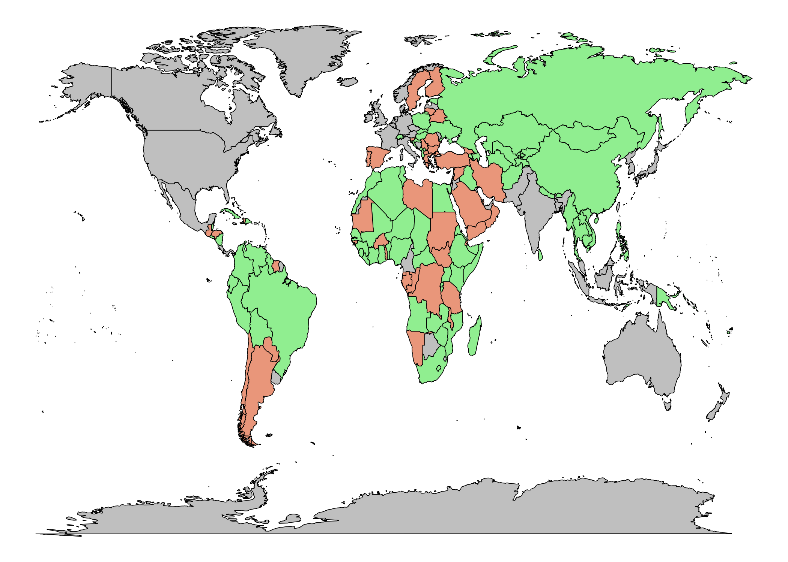
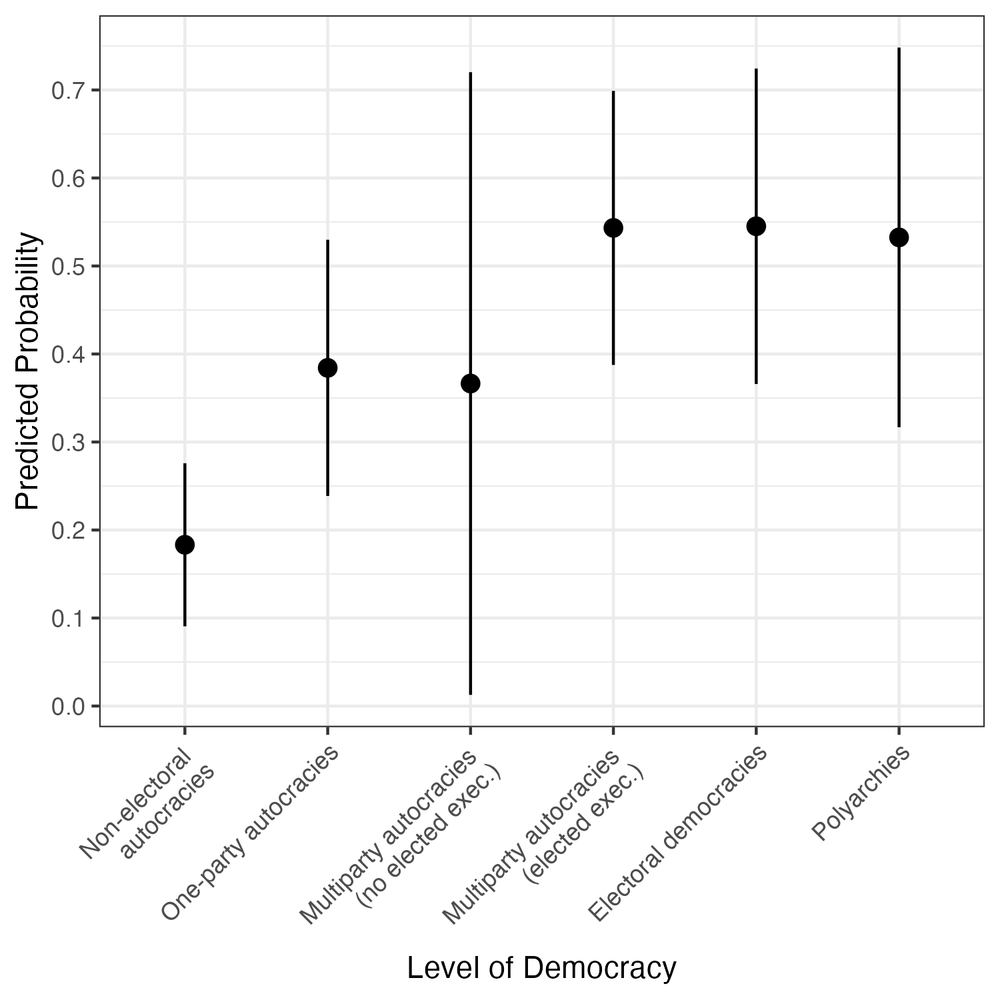
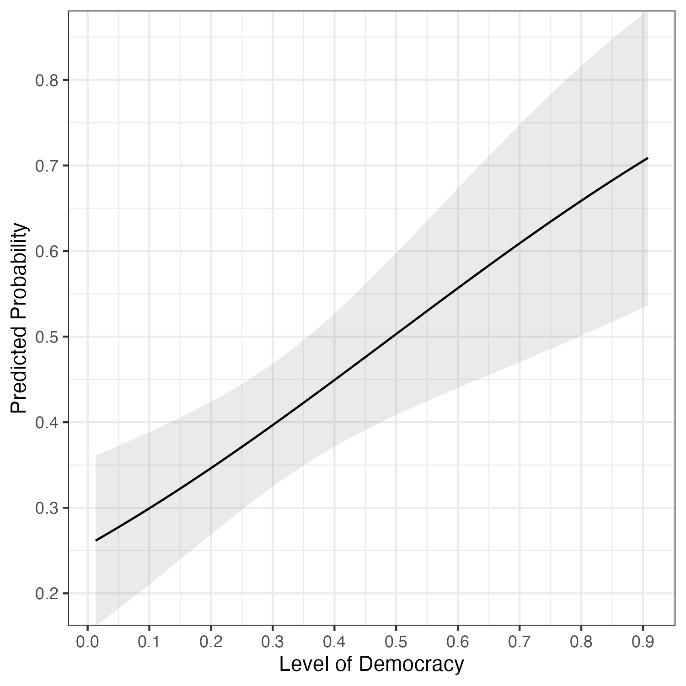

## Abstract

Since 1974, two out of every five constitutions (40.3%) were prepared via processes that included public consultation. The reasons for adopting these participatory mechanisms, however, are largely unexplored. I argue that public consultation is a tool for elite contestation of power. Introducing an original dataset of public consultations in constitution-making processes from 1974-2021 (n = 300), I find that in democracies, factional majorities and newcomer elites use public consultation to legitimate a break from the status quo. In autocracies, governing coalitions that depend on performance and enjoy greater party institutionalization push for public consultation to preserve favorable power-sharing arrangements. 

## Key figures



```{=html}
<div class="va-figure-pair">
  <figure>
    
    <figcaption>Figure 3a: Predicted Probability of Public Consultation Across Level of Democracy (Lexical Index of Democracy)</figcaption>
  </figure>
  <figure>
    
    <figcaption>Figure 3b: Predicted Probability of Public Consultation Across Level of Democracy (V-Dem Electoral Democracy Index)</figcaption>
  </figure>
</div>
```
